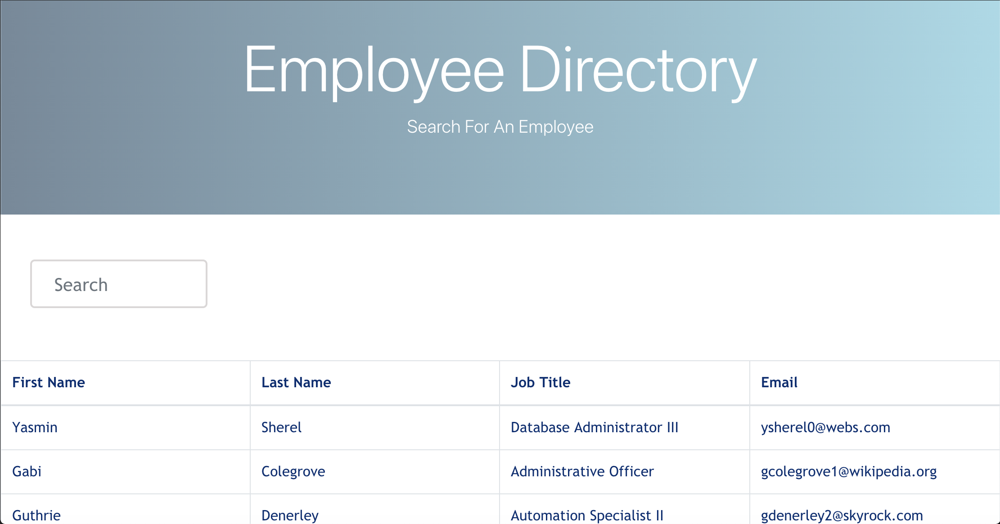

# Employee-Directory

## This application is used to search employees and view nonsensitive data.

## Table of Contents

- [Installation](#installation)
- [Usage](#usage)
- [License](#license)
- [Tests](#tests)
- [Contributors](#contributors)

## Installation

Packages required to run this program are: react, react-dom, react-bootstrap, react-bootstrap-table-next, react-bootstrap-table2-toolkit

## Usage

This application is used to search employees and view nonsensitive data.

## License

None

## Tests

            To test, run the following command: npm run deploy

## Demo

## Contributors

- Cody Walter

## Contact

## View the project repository in GitHub at: https://github.com/codywalter/React-Employee-Directory

## View deployed site at: https://codywalter.github.io/React-Employee-Directory/

### If you have any questions, contact the author directly at: cody.walter@providencecc.edu
